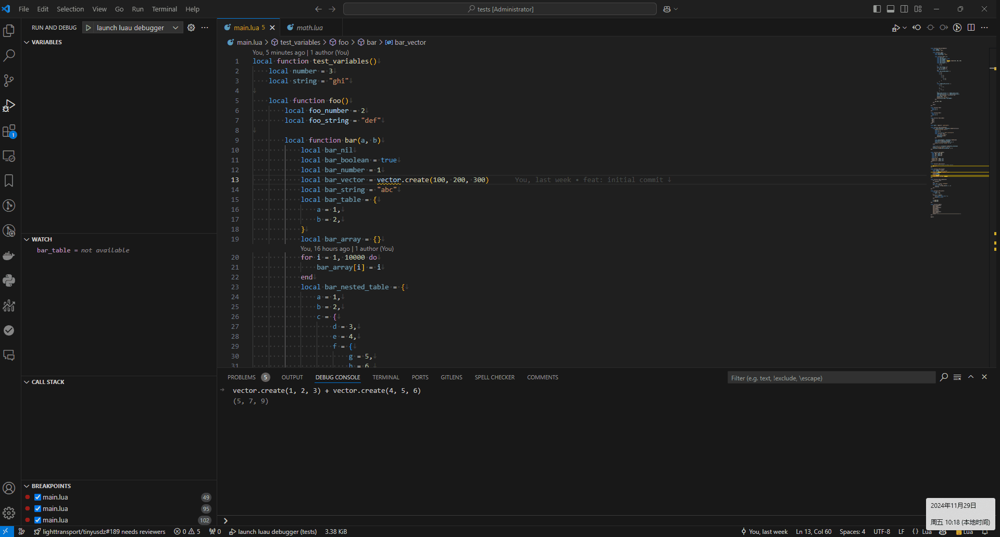

# Luau debugger

A debugger for Luau with debug adapter protocol(DAP) support.



## Overview

```bash
└── luau_debugger
  |
  ├── debugger    # Debugger implementation, include a DAP server and
  |               # a debugger implemented with luau internal debug
  |               # api directly without hooking
  |
  ├── luaud       # A minimal Luau executable with debug support
  ├── extensions  # VSCode extension for Luau debugger
  └── tests       # Test lua scripts
```

## Usage

See [extensions/vscode/README](./extensions/vscode/README.md)

## Dependencies

- [luau](https://github.com/luau-lang/luau)
- [cppdap](https://github.com/google/cppdap)

## Build
- Clone `cppdap` and `luau` repository to local
- Inside `cppdap` root, run `git submodule update --init`
- Build using CMake Presets with CLI or preset, for example with CLI:
  - `cmake -DLUAU_ROOT=<luau path> -DCPP_DAP_ROOT=<cppdap path> -S . -B build`
  - `cmake --build`

## Features

See [features](./extensions/vscode/README.md#features)

## Integration with luau-debugger

See [luaud](./luaud/main.cpp) for how to integrate with `luau-debugger` in your project.

Tips:
- To avoid debug info to be stripped by luau compiler, `Luau::CompileOptions::debugLevel` should be set to `2`
- Call `Debugger::initialize(lua_State* L)` to initialize the debugger
- Call `Debugger::onLuaFileLoaded(lua_State* L, std::string_view path, bool is_entry)` when lua file entry is loaded and lua files are required
- Call `Debugger::listen()` to start the DAP server
- Call `Debugger::onError(std::string_view msg, lua_State* L)` if you want to redirect lua error message to debug console
