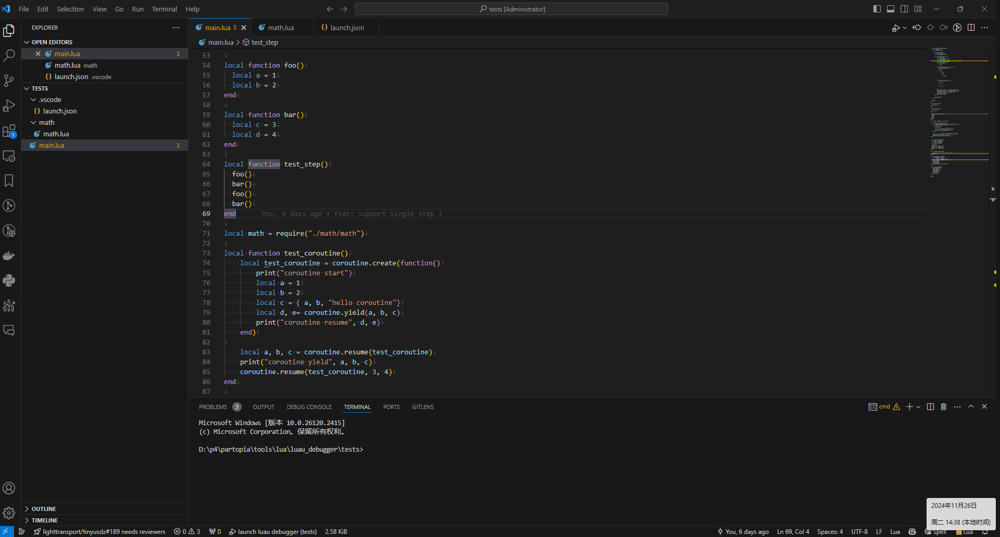

# Luau debugger

A debugger for Luau with debug adapter protocol(DAP) support.



## Overview

```bash
└── luau_debugger
  |
  ├── debugger    # Debugger implementation, include a DAP server and
  |               # a debugger implemented with luau internal debug
  |               # api directly without hooking
  |
  ├── luaud       # A minimal Luau executable with debug support
  ├── extensions  # VSCode extension for Luau debugger
  └── tests       # Test lua scripts
```

## Usage

See [extensions/vscode/README](./extensions/vscode/README.md)

## Dependencies

- luau
- cppdap
  - C++ DAP(Debug Adapter Protocol) library, help to simplify the implementation of a DAP server

## Build
- Clone `cppdap` and `luau` repository to local
- Set `CPP_DAP_ROOT` and `LUAU_ROOT` in `CMakePresets.json`
- Build using CMake Presets by CLI
  - `cmake -S . -B build --preset <configure preset>`
  - `cmake --build --preset <build preset>`
- Or use other IDE such as VSCode or Visual Studio

## Features

See [features](./extensions/vscode/README.md#features)

## Notice

- To avoid debug info to be stripped by luau compiler, `Luau::CompileOptions::debugLevel` should be set to `2`